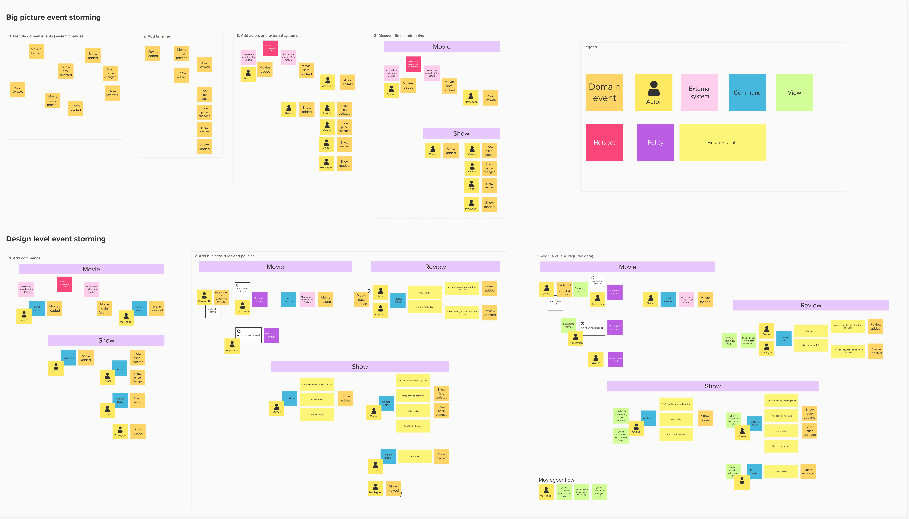
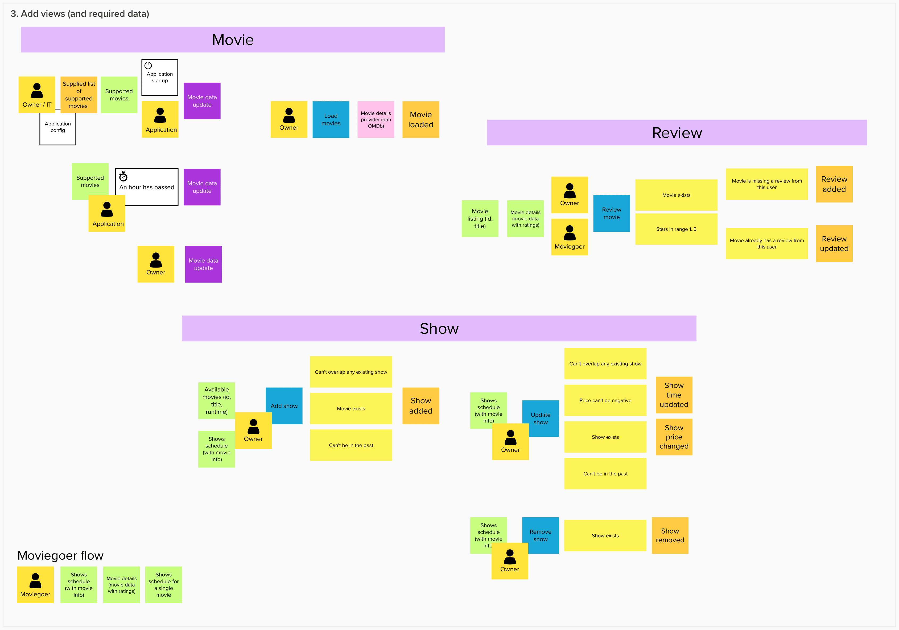

## Setup

```shell
# Run application (with inmemory datasource)
./gradlew bootRun --args='--clients.omdb.api-key=<paste_your_key>'

# Run tests
./gradlew test

# Run application (with mongodb)
docker-compose up # start mongodb container at localhost:27017
./gradlew bootRun --args='--clients.omdb.api-key=<paste_your_key> --setup.useMongo=true'
```

#### Access

Secured endpoints require `Authorization` header with `Bearer <your_token>`.\
There are 2 predefined tokens: `owner-token`, `moviegoer-token`.\

Example: \
`Authorization: Bearer owner-token`

#### Documentation

Swagger is available at http://localhost:8080/swagger-ui/index.html \
Use `Authorize` button to provide correct token.

---

### Event storming

To explore the domain and find a solution I used a workshop method
called [event storming](https://virtualddd.com/learning-ddd/ddd-crew-eventstorming-glossary-cheat-sheet).

Both sessions (big picture, design level) and individual steps are visible in the picture above.
`Big picture event storming` ended up with 2 subdomains (movie, show), but further exploration
in `Design level event storming` discovered another subdomain (review). Workshop helped me acquire the knowledge about
the domain, so I could start with the implementation.

### Event storming -> code


Subdomains are separated on the package level. I've started from modeling empty test scenarios using discovered business rules. Commands are my entry points to each subdomain (facade/handler methods). Aggregates were modeled to meet the business requirements defined in tests. Naming strategy is very consistent (events/commands are basically copied from the event storming) and each type of sticky note used in the `Design level event storming` has its own equivalent in code.

| Sticky note  | Example in code   |
|:-------------|:------------------|
| Domain event | `ShowEvent.kt`      |
| Actor        | `Authentication.kt` |
| External system        | `MovieDataRepository.kt` |
| Command        | `AddShow.kt` |
| View        | `MovieDetails.kt` |
| Policy        | `MovieFacade.kt - loadMovies()` |
| Business rules        | `ReviewSpec.kt` |


### Architecture
The project implements hexagonal architecture separating business logic from the external factors. 
All the business logic encapsulates inside `domain` package. It's divided into smaller, loosely coupled submodules. All of them expose their api using facades (`ShowFacade.kt`, `ReviewFacade.kt` etc.).
Depending on the use case there are 2 different ways of communicating between modules - through the direct api calls or events. Synchronized direct calls are used in scenarios where eventual consistency would be a problem.
Another pattern that I used is CQRS. I treat my aggregates (`Show.kt`) as write models changing due to commands handling (`AddShow.kt`) which generates domain events (`ShowTimeUpdated.kt`). Those domain events are used to update read models (`ShowSchedule.kt`) which contains the data aggregated from the different modules.
Read models are used to represent green sticky notes from the event storming session (`Views`) which users can query (`FindMovieShows.kt`)
That approach makes my modules more independent and clean.

### Ports & Adapters
Domain modules contains ports which define all the interactions they have with anything outside (`MovieRepository.kt`, `MovieDataRepository.kt`). 
Why? Because business logic doesn't really care what is my datasource or how it works, so it just declares interface - communication contract.
On the other hand we have adapters which implement those interfaces (`OMDbRepository.kt`, `InMemoryMovieRepository.kt`, `MongoMovieRepository.kt`).
For example all the MongoDb adapters were added in one commit after everything was already finished, and working with inmemory database. Without modifying domain logic package I've added te possibility to switch data source.

### Tests
I've started with behavior driven tests modeled from business rules discovered at the event storming (`ReviewSpec.kt`, `MovieSpec.kt`). 
During the implementation I was adding tests for the different building blocks like read models or value objects (`MovieDetailsProjectionSpec.kt`, `StarsSpec.kt`, `ShowtimeSpec.kt`,`OMDbClientSpec.kt`)
All of them are unit tests. The only e2e tests I have are located in `AcceptanceSpec.kt` and they cover success path of using the application.
Full coverage in e2e tests is very slow, and I think that there is no need for that if you have nicely encapsulated architecture which works without framework context (spring).

### Database
Project supports 2 data sources - simple inmemory storage and mongodb (check `PersistenceConfiguration.kt`).

### Fault tolerance
Using arrow-fx and coroutines I made a configurable wrapper which supports async operations, retries and exponential backoff.
It's used in OMDb client, and it can be used with MongoDb client (Kmongo also has async support). In real world project I would probably just use Resilience4j.